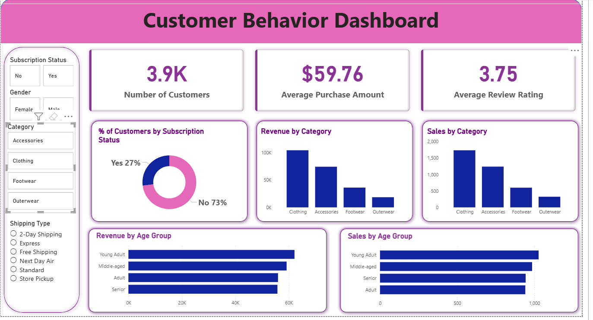

# 📊 Customer Behavior Dashboard – End-to-End Data Analytics Project

## 📝 Overview

This project presents a full end-to-end data analytics workflow — from raw data ingestion to dashboard development and final presentation. The goal is to analyze customer shopping patterns and uncover insights that support data-driven business decisions.

This repository demonstrates expertise in **Python**, **SQL**, **Power BI**, and **data storytelling**.

---

## 📂 Dataset

* **Rows:** 3,900+
* **Columns:** 18
* Includes customer demographics, purchase details, discount usage, ratings, product types, and shipping choices.
* Missing values and inconsistencies were handled during preprocessing.

---

## 🛠 Tools & Technologies

| Area                 | Tools                                       |
| -------------------- | ------------------------------------------- |
| **EDA & Processing** | Python (Pandas, NumPy, Seaborn, Matplotlib) |
| **Databases**        | PostgreSQL / MySQL / SQL Server             |
| **Visualization**    | Power BI                                    |
| **Reporting**        | Gamma Presentation, PDF / DOCX Report       |
| **Version Control**  | Git & GitHub                                |

---

## 🛠️ How to Use This Project

### **1. Clone the Repository**

```bash
git clone https://github.com/nagpuresrushti/Customer_Behavior_Dashboard.git
cd Customer_Behavior_Dashboard
```

---

### **2. Open the Jupyter Notebook**

Open **`Customer_Shopping_Behavior_Analysis.ipynb`** to explore the full analytics workflow.
This notebook includes:

* **Data Import**
* **Data Exploration (EDA)**
* **Data Cleaning & Feature Engineering**
* **Database Connection Setup**
* **Loading Cleaned Data into MySQL / PostgreSQL / SQL Server**

---

### **3. Load Data into SQL Database**

1. Create a database in **MySQL**, **PostgreSQL**, or **SQL Server**
2. Update your DB credentials in the notebook
3. Run the provided Python code to push the cleaned dataset into the SQL database

---

### **4. Run SQL Queries**

Open **`customer_behavior_sql_queries.sql`** to answer business questions such as:

* Revenue comparisons
* Customer segmentation
* Product trends
* Subscription behavior
* Discount-driven purchases

Execute queries in your selected SQL environment.

---

### **5. Build the Power BI Dashboard**

1. Open **`customer_behavior_dashboard.pbix`** in **Power BI Desktop**
2. Connect Power BI to your SQL database
3. Refresh data and interact with visuals
4. Customize or extend the dashboard as needed

---

### **6. Create Report & Presentation**

* Use insights from Python + SQL + Power BI to prepare the **final project report**
* Build a clean, professional **presentation deck** using **Gamma AI**

---

## 🚀 Project Steps

### **1️⃣ Data Loading (Python)**

* Loaded dataset using pandas
* Inspected structure using `.info()`, `.describe()`

### **2️⃣ Exploratory Data Analysis (EDA)**

* Checked distributions, correlations, outliers
* Visualized customer segments, pricing patterns, discount trends

### **3️⃣ Data Cleaning**

* Imputed missing review ratings
* Standardized column names to snake_case
* Removed redundant columns
* Engineered new fields (age groups, purchase frequency)

### **4️⃣ SQL Analysis (PostgreSQL/MySQL/SQL Server)**

Performed business-focused SQL queries including:

* Revenue by gender, age, category
* Subscriber vs. non-subscriber spend
* Discount behavior
* Top products by ratings
* Shipping type comparisons

### **5️⃣ Power BI Dashboard**

Built an interactive dashboard to visualize:

* Customer segments
* Revenue & sales trends
* Product category performance
* Age group behavior
* Subscription insights

### 📸 Dashboard Screenshot


### **6️⃣ Final Report**

Summarized all insights, visuals, and recommendations in a written analysis.

### **7️⃣ Gamma Presentation**

Created a clean, modern PPT summarizing the workflow and key insights.

---

## 📈 Key Results & Insights

* Clothing category generates the highest revenue
* Subscription users contribute significantly to long-term value
* Young Adults & Adults are the highest-spending age groups
* Discount usage influences purchase volume
* Category-level trends help drive targeted marketing

---

## 🗂 Project Structure

```
Customer_Behavior_Dashboard/
├── data/
├── notebooks/
├── sql/
├── dashboard/
├── reports/
├── assets/   ← recommended folder for images/screenshots
└── README.md
```

---

